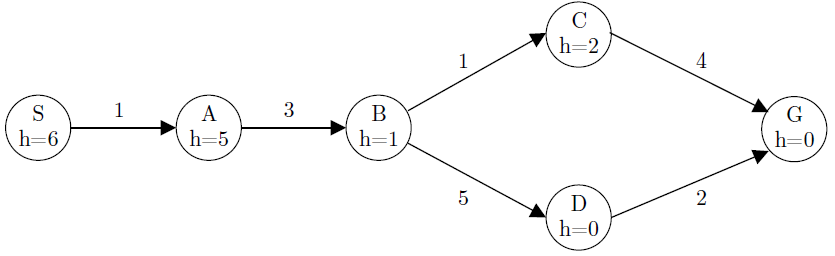
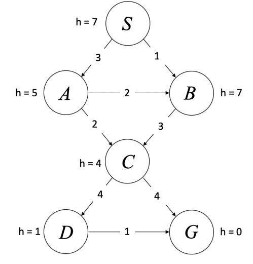

# Assignment 1 – Search Total points: 8-point

Each question is worth 0.5 point. Leaving a question blank is worth 0 points.
Answering incorrectly is worth -0.5 points.

## Q1

### (a)

Consider a graph search problem where for every action, the cost is at
least 𝜖, with 𝜖 > 0. Assume the used heuristic is consistent. (Total: 3.5-point)

(i) [true or false] Depth-first graph search is guaranteed to return an optimal
solution.

False.

(ii) [true or false] Breadth-first graph search is guaranteed to return an
optimal solution.

False.

(iii) [true or false] Uniform-cost graph search is guaranteed to return an
optimal solution.

True.

(iv) [true or false] Greedy graph search is guaranteed to return an optimal
solution.

False.

(v) [true or false] A* graph search is guaranteed to return an optimal solution.

True.

(vi) [true or false] A* graph search is guaranteed to expand no more nodes than
depth-first graph search.

False.

(vii) [true or false] A* graph search is guaranteed to expand no more nodes
than uniform-cost graph search.

True.

### (b)

Let h1(s) be an admissible A* heuristic. Let h2(s) = 2h1(s). Then:
(total: 1.5-point)

(i) [true or false] The solution found by A* tree search with h2 is guaranteed
to be an optimal solution.

False. h2 is not necessarily admissible.

(ii) [true or false] The solution found by A* tree search with h2 is
guaranteed to have a cost at most
twice as much as the optimal path.

True. Proof by induction.

(iii) [true or false] The solution found by A* graph search with h2 is
guaranteed to be an optimal solution.

False. h2 is not necessarily admissible, not to mention consistent.

### (c\)

The heuristic values for the graph below are not correct. For which single
state (S, A, B, C, D, or G) could you

change the heuristic value to make everything admissible and consistent? What
range of values are possible to
make this correction? (Total: 1-point)

State:

Range:

## Q2

We will investigate various search algorithms for the following graph. Edges
are labeled with their costs,
and heuristic values h for states are labeled next to the states. S is the
start state, and G is the goal state. In all
search algorithms, assume ties are broken in alphabetical order.

(a) Select all boxes that describe the given heuristic values. (Multi-choice)
(0.5-point)

- [ ] Admissible
- [ ] Consistent
- [ ] Neither

(b) Given the above heuristics, what is the order that the states are going to
be expanded in, assuming
we run A* graph search with the heuristic values provided. (0.5-point)

Index|1|2|3|4|5|Not expanded
-|-|-|-|-|-|-
S|-|-|-|-|-|-
A|-|-|-|-|-|-
B|-|-|-|-|-|-
C|-|-|-|-|-|-
D|-|-|-|-|-|-
G|-|-|-|-|-|-

(c\) Assuming we run A* graph search with the heuristic values provided, what
path is returned? (0.5-point)

- [ ] 𝑆→𝐴→𝐵→𝐶→𝐷→𝐺
- [ ] 𝑆→𝐴→𝐶→𝐺
- [ ] 𝑆→𝐴→𝐶→𝐷→𝐺
- [ ] 𝑆→𝐵→𝐶→𝐺
- [ ] 𝑆→𝐴→𝐵→𝐶→𝐺
- [ ] 𝑁𝑜𝑛𝑒 𝑜𝑓 𝑡ℎ𝑒 𝑎𝑏𝑜𝑣𝑒

(d) Given two admissible heuristics $h_𝐴$ and $h_𝐵$. Which of the
following are guaranteed to also be
admissible heuristics? (Multi-choice) (0.5-point)

- [ ] $h_A+h_B$
- [ ] $\frac{1}{2}(h_A)$
- [ ] $\frac{1}{2}(h_B)$
- [ ] $\frac{1}{2}(h_A+h_B)$
- [ ] $h_A\times h_B$
- [ ] $\max(h_A,h_B)$
- [ ] $\min(h_A,h_B)$
