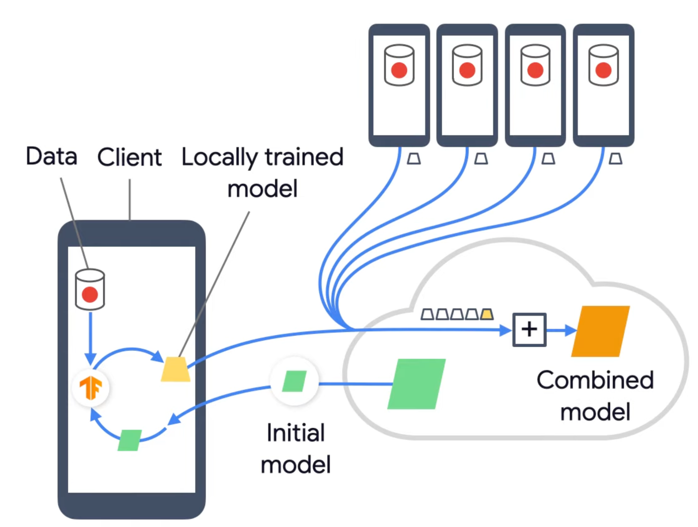
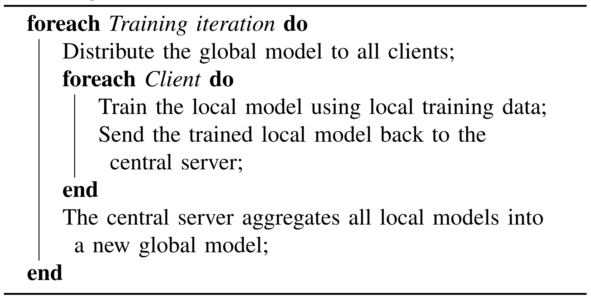
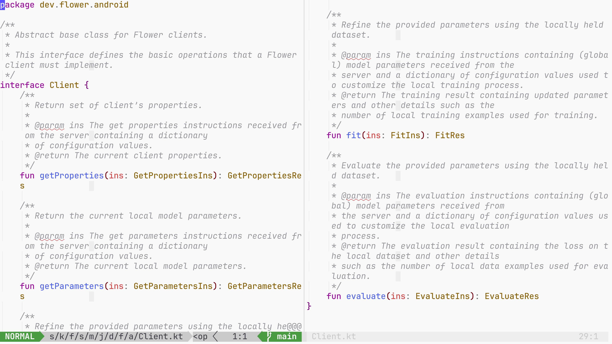

<!-- slide -->
# Practical Federated Learning on Mobile Devices

COMPSCI 402—Artificial Intelligence\
Final Report

Steven Hé (Sīchàng)

<!-- slide -->
## Roadmap

- Basic concepts
- Opportunities & challenges
- General procedure
- Scheduling
- Communication
- On-device training

<!-- slide -->
## Artificial Intelligence (AI)

Artificial machineries that resembles human intelligence,
either in terms of their functionality or behavior.

<!-- slide -->
## Machine Learning (ML)

The study of intelligent agents that
can adapt to previously unseen situations based on historical data.

<!-- slide -->
## Federated Learning (FL)

<small>"What is Federated Learning" on YouTube</small>

<!-- slide -->
## Centralized VS Federated Learning

<small>"What is Federated Learning" on YouTube</small>

<!-- slide -->
- Basic concepts

---

- Opportunities & challenges
- General procedure
- Scheduling
- Communication
- On-device training

<!-- slide -->
## Why FL on Mobile Devices

- Demand for ML training data
- Privacy regulations
- Core of ML problem

<!-- slide -->
## Why *Not* FL on Mobile Devices

- Performance overhead
- Heterogeneity problem
- On-device training difficulties

<!-- slide -->
- Basic concepts
- Opportunities & challenges

---

- General procedure
- Scheduling
- Communication
- On-device training

<!-- slide -->

<!-- slide -->

<!-- slide -->

Main problems

- Scheduling
- Communication
- On-device training

<!-- slide -->

<small>Communication-Efficient Learning of Deep Networks from Decentralized Data
</small>

<!-- slide -->

Main problems

- Scheduling: straggler problem
- Communication: network limitations
- On-device training: parameter alignment

<!-- slide -->
- Basic concepts
- Opportunities & challenges
- General procedure

---

- Scheduling
- Communication
- On-device training

<!-- slide -->

<small>Communication-Efficient Learning of Deep Networks from Decentralized Data
</small>

<!-- slide -->
### Addressing Straggler Problem

- Timeout
- Variable local epochs: FedProx
- Async FL

<!-- slide -->
### Testing Scheduling Strategies

- Simulation frameworks\
    TensorFlow Federated, PaddleFL, FATE, OpenFL, Syft…
- Benchmarks\
    FedScale, FedML…

<!-- slide -->
### Implementing Custom Scheduling

- Interfaces: FedML, Flower
- Server in Python
- Clients on Java/Swift

<!-- slide -->

<small>https://github.com/adap/flower/blob/4df413f8a1696f643fdde27bf7bac8c33b623f56/src/kotlin/flwr/src/main/java/dev/flower/android/Client.kt
</small>

<!-- slide -->

#### FLaaS Server

